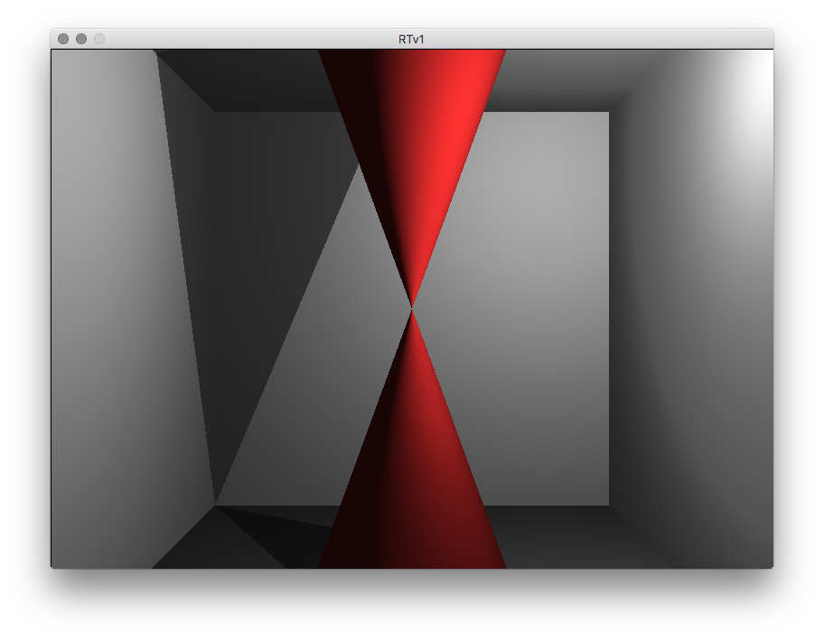
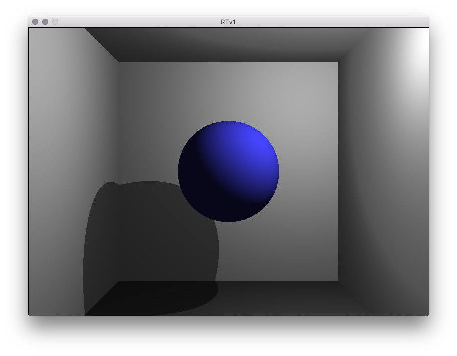
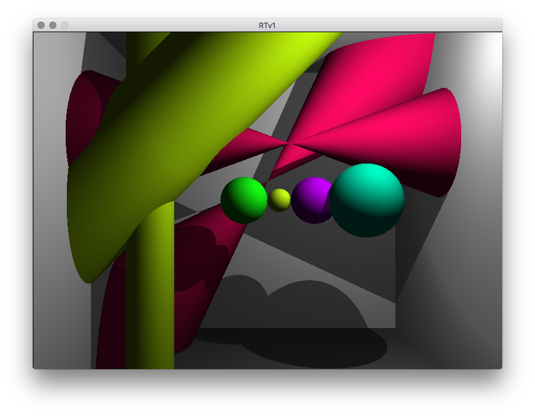
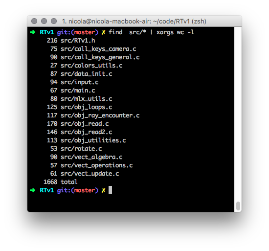

# 42-RTv1
First Ray tracer in C. Personal project developed at Ecole 42.

# Functionalities:
- The program traces rays from one camera to n objects, the objects have shading and cast shadows on eachother based the postion of a singel source of light.
- it takes keyboard input for moving the camera (W,A,S,D,Q,E), rotate the camera (arrows) moving the light(J,K), changing resolution (\[,\]) and fov angle (+,-) in the scene in real time.
- RTv1 takes as input a custom file format based on comma separated values (examples found in the scenes folder), from the file it can get these informations:
	- camera (location and direction);
	- light (location);
	- objects:
		- sphere (color, location and radius);
		- cylinder (color, location, axis and radius);
		- cone (color, location, axis and angle);
		- plane (color, normal and distance from 0,0,0);

# Examples
```
./rtv1 scenes/room_sphere
```


# Images





# How to use:
install minilibx, got to the folder and type "make" in the comand line then run ./rtv1 witht he path of a scene as argument.
example:
```
make
./rtv1 scenes/room_cone
```

# Challenges
this program was created without much help from standard libraries, these are all the standard function used:
- open
- read
- write
- malloc
- free
- math:
	- sin()
	- cos()
	- pow()
- mlx graphic library:
	- to create a window
	- use keyboard input
	- color a single pixel
most standard library functions were recreated in a previous project called LIBFT.



TODO:
	- Finish implementing SDL2 framework
	
